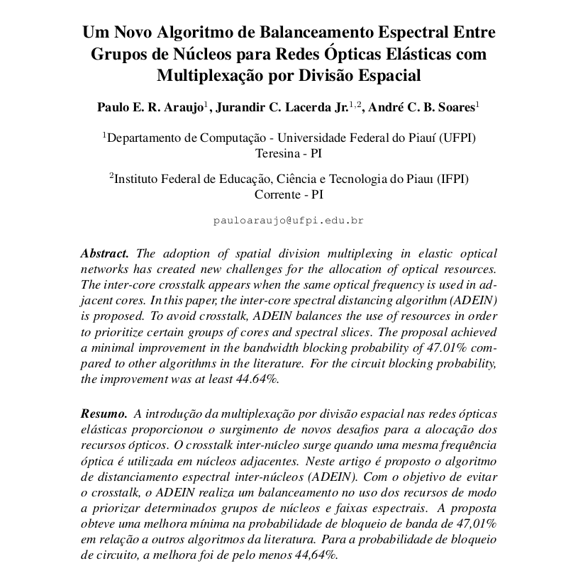

# 🚀 Algoritmo de Distanciamento Especial 

 

> Algoritmo SCA(Spectrum and Core Allocation) para Redes Ópticas Elásticas com Multiplexação por Divisão Espacial.

 

## 💻 Feito Com:

## 📫 Contribuindo com o Projeto
<!---Se o seu README for longo ou se você tiver algum processo ou etapas específicas que deseja que os contribuidores sigam, considere a criação de um arquivo CONTRIBUTING.md separado--->
Para contribuir com website, siga estas etapas:

1. Bifurque este repositório.
2. Crie um branch: `git checkout -b <nome_branch>`.
3. Faça suas alterações e confirme-as: `git commit -m '<mensagem_commit>'`
4. Envie para o branch original: `git push origin <adein-to-sdm> / <local>`
5. Crie a solicitação de pull.

Como alternativa, consulte a documentação do GitHub em [como criar uma solicitação pull](https://help.github.com/en/github/collaborating-with-issues-and-pull-requests/creating-a-pull-request).

## 🤝 Colaboradores

Agradecemos às seguintes pessoas que contribuíram para este projeto:

<table>
  <tr>
    <td align="center">
      <a href="https://github.com/pumba-dev" target="_blank" >
         
        
          <b>Eu Mesmo</b>
        
      </a>
    </td>
    <td align="center">
      <a href="https://www.instagram.com/jurandirjr1/" target="_blank">
         
        
          <b>Dr. Jurandir Lacerda</b>
        
      </a>
    </td>
    <td align="center">
      <a href="https://www.linkedin.com/in/andr%C3%A9-soares-35b30216/" target="_blank">
         
        
          <b>Prof. André Soáres</b>
        
      </a>
    </td>
  </tr>
</table>

 

## 😄 Seja um dos Contribuidores 

Entre em contato para se tornar um contribuidor.

## 💰 Donate

## 📝 Licença

Copyright © 2021 Pumba Developer
